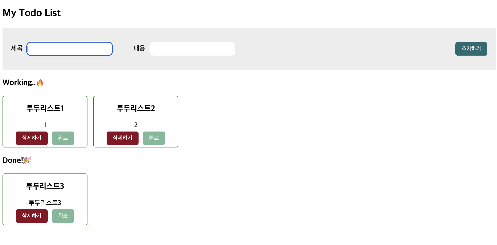

# 📁 투두리스트

 

# 🌑 구현기능

- 제목과 내용(입력)폼 구현 : 할 일(Todo)을 입력하고 삭제할 수 있는 CRUD 구현하기
- Create : 새로운 투두 추가
- Read : 추가한 투두 확인
- Update : 추가한 투두의 완료 or 취소
- Delete : 선택한 투두리스트 삭제

 

# ✔️추가기능

- 유효성 검사

1. 빈칸이 있을 경우 알림

 

# 🚀 트러블 슈팅

[전역변수 선언 및 toggle] [리액트에서 토글로 입력과 취소 기능을 부여하자](https://izzie-note.tistory.com/122)
